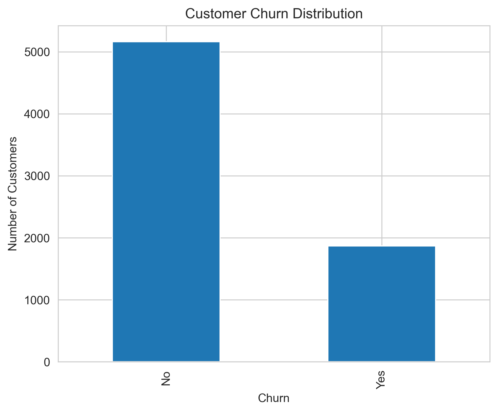
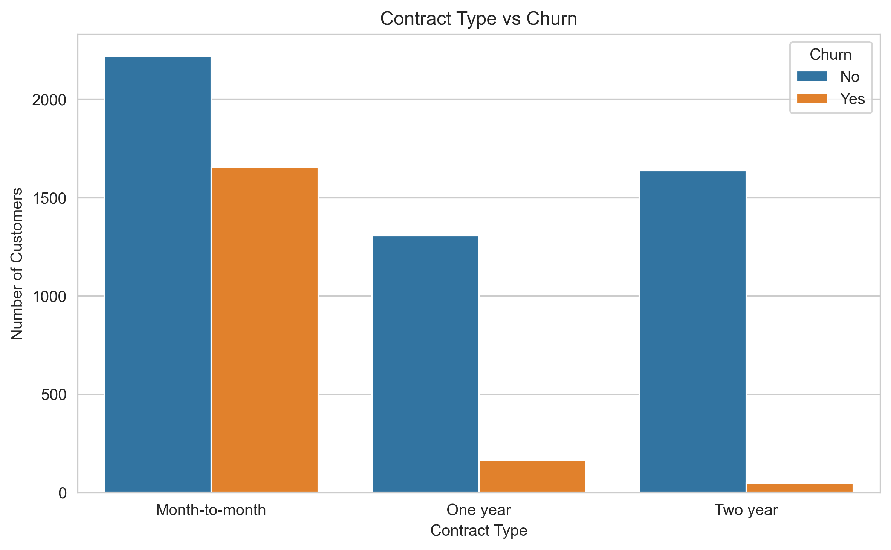

# 📉 Customer Analytics & Churn Prediction Project


## 📌 Project Overview

This project analyzes customer behavior, sales performance, customer support efficiency, and churn patterns using real-world styled datasets. The goal is to generate **actionable business insights** and understand **factors influencing customer churn**.

> ⚠️ **Note before running:** raw datasets are not included in this repo (see Datasets section below for download links and setup instructions).

---

## 🖼️ Sample Visualizations





---

## 🎯 Business Objectives

- Understand revenue trends and top-performing regions
- Analyze customer purchasing behavior
- Evaluate customer support efficiency
- Identify churn drivers
- Present insights using clear visualizations

---

## 📁 Datasets Used

This project uses **three datasets, all sourced from Kaggle**. Raw files are not included in this repo — download them and run `02_Data_Loading_and_Cleaning.ipynb` to generate the cleaned versions used by the rest of the notebooks.

| Dataset | Source | Save as |
|---|---|---|
| Online Retail II | [Kaggle link](https://www.kaggle.com/code/mashlyn/onlineretail-ii-simple-eda) | `data/online_retail_II.csv` |
| Customer Support Tickets | [Kaggle link](https://www.kaggle.com/datasets/suraj520/customer-support-ticket-dataset) | `data/support_tickets.csv` |
| Telco Customer Churn | [Kaggle link](https://www.kaggle.com/datasets/blastchar/telco-customer-churn) | `data/telco_customer_churn.csv` |

> Create a `data/` folder at the **project root** (same level as `notebooks/`), place all three downloaded files there with the exact filenames above, then run `02_Data_Loading_and_Cleaning.ipynb` — it will clean the data and automatically save the processed versions to `notebooks/data/` for the rest of the notebooks to use.

---

## 🛠 Tools & Technologies

| Category | Tools / Libraries |
|----------|------------------|
| Data Cleaning + Wrangling | Python, Pandas, NumPy |
| SQL Analysis | SQLite |
| Visualization | Matplotlib, Seaborn |
| Machine Learning | Scikit-learn (Random Forest) |
| Notebook Environment | Jupyter Notebook |

---

## 📊 Project Phases

### Phase 1: Business Understanding
Defined business problems and KPIs; identified revenue and churn-related questions.

### Phase 2: Data Cleaning & Preparation
Loads raw data from `data/`, handles missing and inconsistent values, creates derived metrics (e.g., `TotalAmount`, `Churn_flag`), and saves cleaned datasets to `notebooks/data/` for the rest of the pipeline.

### Phase 3: SQL Analysis
Revenue by country and month, top-selling products, support ticket performance, churn rate by contract type — 10 queries run against an in-memory SQLite database inside `03_SQL_Analysis.ipynb`, with outputs saved to `sql_outputs/`.

### Phase 4: Machine Learning Modeling
Trained a Random Forest classifier to predict customer churn; evaluated with accuracy, precision, recall, and feature importance. Also tested class-balancing to address churn-class imbalance — see Model Performance below for results.

### Phase 5: Data Visualization
Revenue trends, product performance, support ticket distribution, churn behavior insights.

---

## 📈 Key Insights

- **United Kingdom drives ~89% of total revenue** (₹1.47M of ~₹1.65M total) — the business is heavily concentrated in one market
- Revenue is strongly seasonal, **peaking every November** (₹1.03M–1.17M) — consistent with pre-holiday retail buying, and dropping to its lowest in **February**
- The single highest-spending customer (ID 18102) generated **₹608,821** across 1,058 orders — high-value accounts are worth identifying and protecting individually
- **Month-to-month contract customers churn at 42.7%**, vs. **11.3%** for one-year and just **2.9%** for two-year contracts — contract length is the single strongest churn signal in the data
- Month-to-month customers also pay the **highest average monthly charges** (₹66.40 vs. ₹60.87 for two-year customers) — they're paying more *and* leaving more, a clear retention target
- Refund requests (1,752) and technical issues (1,747) are the two most common support ticket types, nearly tied
- Customer satisfaction is fairly flat across ticket priority levels (2.96–3.05 out of 5) — priority level alone doesn't explain satisfaction

---

## 🤖 Model Performance

Random Forest Classifier, trained on the Telco churn dataset (80/20 train-test split):

| Metric | Not Churn (0) | Churn (1) |
|---|---|---|
| Precision | 0.83 | 0.64 |
| Recall | 0.90 | 0.48 |
| F1-Score | 0.86 | 0.55 |

**Overall accuracy: 79%**

**Honest read:** the model is noticeably better at correctly identifying customers who *won't* churn than those who will — it catches under half (48%) of actual churners. Class-balancing (`class_weight="balanced"`) was tested as a potential fix but slightly reduced recall (0.45) rather than improving it, so the original unweighted model was kept. This is a common pattern with imbalanced churn data; a production system would likely need additional features or a different resampling technique (e.g. SMOTE) to meaningfully improve churn-class recall.

---

## 💡 Business Recommendations

| # | Recommendation | Rationale |
|---|---|---|
| 1 | Prioritize retention campaigns for month-to-month customers | 42.7% churn rate — by far the highest-risk segment |
| 2 | Offer incentives to convert month-to-month customers to annual contracts | Churn drops from 42.7% to 11.3% at just one year of contract length |
| 3 | Build an account management program for top-spending customers (e.g. the ₹608K+ tier) | Revenue is highly concentrated in a small number of high-value customers |
| 4 | Diversify revenue beyond the UK market | ~89% revenue concentration in one country is a single point of failure |

---

## ▶️ How to Run the Project

### 1️⃣ Clone the Repository
```bash
git clone https://github.com/aprajitad/Customer-Analytics-Churn-Prediction-Project.git
cd Customer-Analytics-Churn-Prediction-Project
```

### 2️⃣ Install Required Libraries
```bash
pip install -r requirements.txt
```

### 3️⃣ Download the Datasets
Download all three datasets from the Kaggle links above, and place them in a `data/` folder at the project root using the exact filenames listed in the Datasets table.

### 4️⃣ Run the Notebooks
Open Jupyter and run the notebooks **in order**:
1. `01_Business_Understanding.ipynb`
2. `02_Data_Loading_and_Cleaning.ipynb` 
3. `03_SQL_Analysis.ipynb`
4. `04_ML_Modeling.ipynb`
5. `05_Data_Visualization.ipynb`

---

## 📂 Repository Structure

```
Customer-Analytics-Churn-Prediction-Project/
│
├── notebooks/
│   ├── 01_Business_Understanding.ipynb
│   ├── 02_Data_Loading_and_Cleaning.ipynb
│   ├── 03_SQL_Analysis.ipynb
│   ├── 04_ML_Modeling.ipynb
│   └── 05_Data_Visualization.ipynb
│
├── sql_queries_outputs/
│   ├── churn_contract.csv
│   ├── monthly_contract.csv
│   ├── monthly_revenue.csv
│   ├── resolution_time.csv
│   ├── revenue_country.csv
│   ├── satisfaction_priority.csv
│   ├── ticket_type.csv
│   ├── top_customers.csv
│   ├── top_products.csv
│   └── top_support_customers.csv
│
├── visualizations/
│   ├── churn_distribution.png
│   ├── contract_type_vs_churn.png
│   ├── monthly_revenue_trend.png
│   ├── monthlycharges_vs_churn.png
│   ├── revenue_by_country.png
│   ├── ticket_status_distribution.png
│   ├── ticketvolume_by_ticketstatus.png
│   └── top_selling_products.png
│
├── requirements.txt
└── README.md

```

---

## 👤 Author

**Aprajita Dixit**
Data & Business Analyst | SQL | Python | Power BI

- **LinkedIn:** [linkedin.com/in/dixitaprajita](https://www.linkedin.com/in/dixitaprajita/)
- **GitHub:** [@aprajitad](https://github.com/aprajitad)
