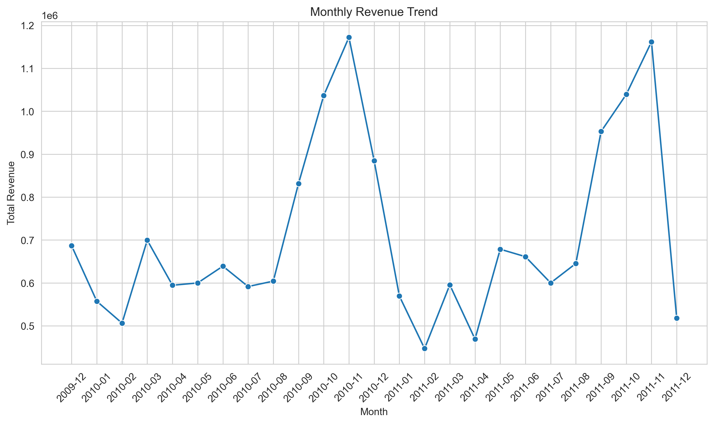

# 📉 Customer Analytics & Churn Prediction Project


## 📌 Project Overview

This project analyzes customer behavior, sales performance, customer support efficiency, and churn patterns using real-world styled datasets. The goal is to generate **actionable business insights** and understand **factors influencing customer churn**.

> ⚠️ **Note before running:** the retail transactions dataset is not included in this repo due to GitHub file size limits. See the Datasets section below for the download link and where to place it.

---

## 🖼️ Sample Visualizations




---

## 🎯 Business Objectives

- Understand revenue trends and top-performing regions
- Analyze customer purchasing behavior
- Evaluate customer support efficiency
- Identify churn drivers
- Present insights using clear visualizations

---

## 📁 Datasets Used

This project uses **three datasets**:

### 1️⃣ Retail Transactions Dataset
- 805,549 transaction records — revenue, sales trends, and product analysis
- **Large file — not uploaded to GitHub due to size limits**
- Source: [Kaggle — Online Retail Dataset](https://www.kaggle.com/code/mashlyn/onlineretail-ii-simple-eda)

> Download the dataset from Kaggle and place it inside `notebooks/data/retail_cleaned.csv` to run the notebooks successfully.

### 2️⃣ Customer Support Tickets Dataset
- 8,469 support tickets — ticket volume, resolution time, and customer satisfaction analysis
- Cleaned CSV is uploaded to GitHub — `notebooks/data/support_cleaned.csv`

### 3️⃣ Telecom Customer Churn Dataset
- 7,032 customer records — churn analysis and modeling
- Cleaned CSV is uploaded to GitHub — `notebooks/data/telco_cleaned.csv`

---

## 🛠 Tools & Technologies

| Category | Tools / Libraries |
|----------|------------------|
| Data Cleaning + Wrangling | Python, Pandas, NumPy |
| SQL Analysis | SQLite |
| Visualization | Matplotlib, Seaborn |
| Machine Learning | Scikit-learn (Random Forest) |
| Notebook Environment | Jupyter Notebook |

---

## 📊 Project Phases

### Phase 1: Business Understanding
Defined business problems and KPIs; identified revenue and churn-related questions.

### Phase 2: Data Cleaning & Preparation
Handled missing and inconsistent values, created derived metrics (e.g., `TotalAmount`, `Churn_flag`), saved cleaned datasets for analysis.

### Phase 3: SQL Analysis
Revenue by country and month, top-selling products, support ticket performance, churn rate by contract type — 10 queries in `sql/sql_queries.py`, outputs saved as CSV files in `sql/sql_outputs/`.

### Phase 4: Machine Learning Modeling
Trained a Random Forest classifier to predict customer churn; evaluated with accuracy, precision, recall, and feature importance.

### Phase 5: Data Visualization
Revenue trends, product performance, support ticket distribution, churn behavior insights.

---

## 📈 Key Insights

- **United Kingdom drives ~89% of total revenue** (₹1.47M of ~₹1.65M total) — the business is heavily concentrated in one market
- Revenue is strongly seasonal, **peaking every November** (₹1.03M–1.17M) — consistent with pre-holiday retail buying, and dropping to its lowest in **February**
- The single highest-spending customer (ID 18102) generated **₹608,821** across 1,058 orders — high-value accounts are worth identifying and protecting individually
- **Month-to-month contract customers churn at 42.7%**, vs. **11.3%** for one-year and just **2.9%** for two-year contracts — contract length is the single strongest churn signal in the data
- Month-to-month customers also pay the **highest average monthly charges** (₹66.40 vs. ₹60.87 for two-year customers) — they're paying more *and* leaving more, a clear retention target
- Refund requests (1,752) and technical issues (1,747) are the two most common support ticket types, nearly tied
- Customer satisfaction is fairly flat across ticket priority levels (2.96–3.05 out of 5) — priority level alone doesn't explain satisfaction; worth investigating resolution speed instead (see note on data quality below)

> **Data quality note:** the average resolution time query currently returns an identical, implausible value (2023 hours) across all ticket types — this points to `Time to Resolution` being stored as a date/timestamp rather than a duration in the source data. Recommend recalculating this as `Time to Resolution − Date of Purchase` before drawing conclusions from it.

---

## 🤖 Model Performance

Random Forest Classifier, trained on the Telco churn dataset (80/20 train-test split):

| Metric | Not Churn (0) | Churn (1) |
|---|---|---|
| Precision | 0.83 | 0.64 |
| Recall | 0.90 | 0.48 |
| F1-Score | 0.86 | 0.55 |

**Overall accuracy: 79%**

**Honest read:** the model is noticeably better at correctly identifying customers who *won't* churn than those who will — it catches under half (48%) of actual churners. This is a common pattern with imbalanced churn data and a reasonable baseline, but a production system would benefit from class balancing (e.g. `class_weight="balanced"` or SMOTE) to improve churn-class recall specifically, since missing a churner is more costly to the business than a false alarm.

---

## 💡 Business Recommendations

| # | Recommendation | Rationale |
|---|---|---|
| 1 | Prioritize retention campaigns for month-to-month customers | 42.7% churn rate — by far the highest-risk segment |
| 2 | Offer incentives to convert month-to-month customers to annual contracts | Churn drops from 42.7% to 11.3% at just one year of contract length |
| 3 | Build an account management program for top-spending customers (e.g. the ₹608K+ tier) | Revenue is highly concentrated in a small number of high-value customers |
| 4 | Diversify revenue beyond the UK market | ~89% revenue concentration in one country is a single point of failure |
| 5 | Fix resolution-time tracking before using it for support SLA decisions | Current data is not usable in its raw form (see data quality note above) |

---

## ▶️ How to Run the Project

### 1️⃣ Clone the Repository
```bash
git clone https://github.com/aprajitad/Customer-Analytics-Churn-Prediction-Project.git
cd Customer-Analytics-Churn-Prediction-Project
```

### 2️⃣ Install Required Libraries
```bash
pip install -r requirements.txt
```

### 3️⃣ Get the Retail Dataset
Download from the [Kaggle link above](https://www.kaggle.com/code/mashlyn/onlineretail-ii-simple-eda) and place it at `notebooks/data/retail_cleaned.csv`.

### 4️⃣ Run the Notebooks
Open Jupyter and run the notebooks **in order**:
1. `01_Business_Understanding.ipynb`
2. `02_Data_Loading_and_Cleaning.ipynb`
3. `03_SQL_Analysis.ipynb`
4. `04_ML_Modeling.ipynb`
5. `05_Data_Visualization.ipynb`

---

## 📂 Repository Structure

```
Customer-Analytics-Churn-Prediction-Project/
│
├── notebooks/
│   ├── data/
│   │   ├── support_cleaned.csv
│   │   ├── telco_cleaned.csv
│   │   └── retail_cleaned.csv (download from Kaggle)
│   │
│   ├── 01_Business_Understanding.ipynb
│   ├── 02_Data_Loading_and_Cleaning.ipynb
│   ├── 03_SQL_Analysis.ipynb
│   ├── 04_ML_Modeling.ipynb
│   └── 05_Data_Visualization.ipynb
│
├── sql/
│   ├── sql_queries.py
│   └── sql_outputs/
│       └── *.csv
│
├── visualizations/
│   └── *.png
│
├── requirements.txt
└── README.md
```

---

## 👤 Author

**Aprajita Dixit**
Data & Business Analyst | SQL | Python | Power BI

- **LinkedIn:** [linkedin.com/in/dixitaprajita](https://www.linkedin.com/in/dixitaprajita/)
- **GitHub:** [@aprajitad](https://github.com/aprajitad)
